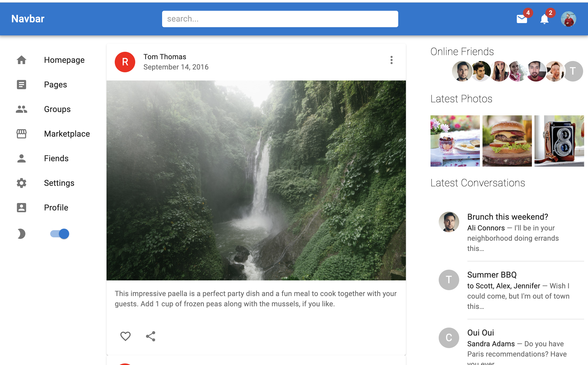
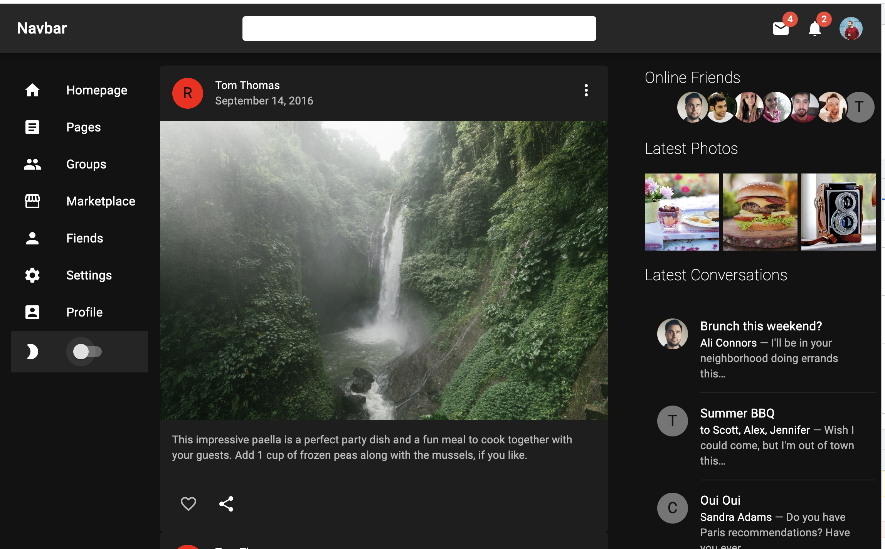

<h1 align="center">
    Material UI - MUI - Example
    <br>
</h1>

<div align="center">


[]()

</div>

# Overview

The App was built based on mui.com components, the main objective here is to show how dark and light themes work.

You can change between "dark" and "light" when you click on a Switch component.

# The code

```js
import { createTheme, ThemeProvider } from "@mui/material";

function App() {
  //Handle theme change logic: "light" or "dark"
  const [mode, setMode] = useState("dark");

  //Create theme
  const darkTheme = createTheme({
    palette: {
      mode: mode,
    },
  });

  return (
    <ThemeProvider theme={darkTheme}>
      <Box bgcolor={"background.default"} color={"text.primary"}>
        // Props to Sidebar to handle the theme background
        <Sidebar setMode={setMode} mode={mode} />
      </Box>
    </ThemeProvider>
  );
}
```

## Sidebar component

```js
    const Sidebar = ({ mode, setMode }) => {

    return(
        ...
        <Switch
            onChange={(e) => setMode(mode === "light" ? "dark" : "light")}
        />
    )};
```

<br />

## Light



## Dark


<br />

# Getting Started with Create React App

This project was bootstrapped with [Create React App](https://github.com/facebook/create-react-app).

## Available Scripts

In the project directory, you can run:

### `yarn start`

Runs the app in the development mode.\
Open [http://localhost:3000](http://localhost:3000) to view it in your browser.

The page will reload when you make changes.\
You may also see any lint errors in the console.
